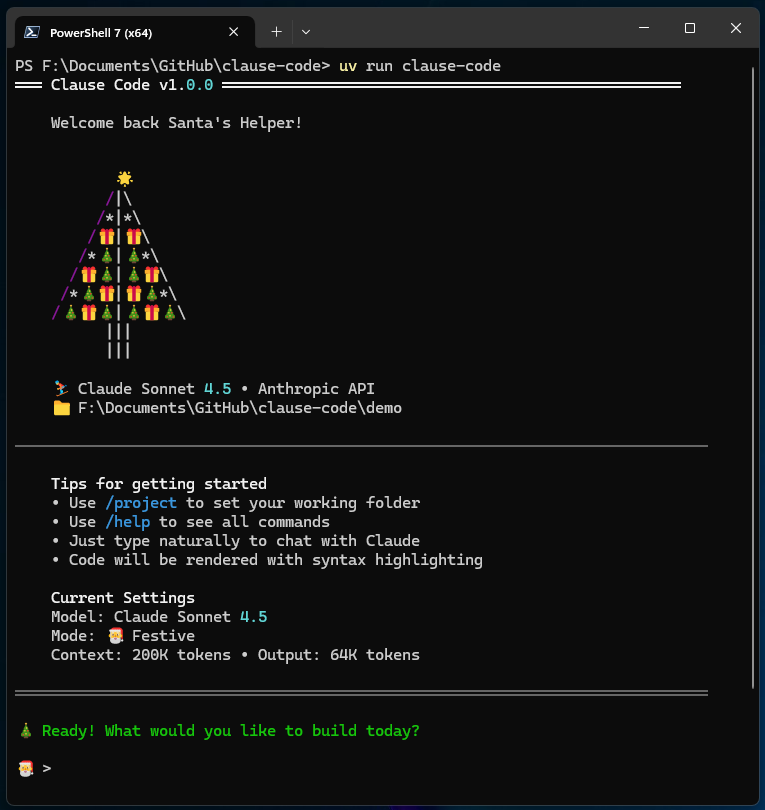

<div align="center">

# 🎄 Clause Code

**A festive AI coding assistant that brings holiday cheer to your terminal**

[](https://www.python.org/downloads/)
[](https://opensource.org/licenses/MIT)
[](https://www.anthropic.com)
[](https://github.com/psf/black)

</div>

---

## 🎁 What is Clause Code?

Clause Code is an interactive terminal-based AI coding assistant powered by Anthropic's Claude. It combines powerful AI capabilities with delightful holiday theming to make your coding sessions more enjoyable and productive.

**Key Features:**
- 💬 Interactive chat interface with Claude's latest models (Sonnet 4.5, Haiku 4.5, Opus 4.1)
- 🎨 Beautiful terminal UI with syntax highlighting and festive animations
- 📝 Automatic code extraction and file writing
- 🎄 Holiday-themed status messages and ASCII art
- 📚 Command history with auto-completion
- 🎅 Daily December coding challenges (advent calendar)
- ⚙️ Flexible configuration with multiple Claude models

## 📸 Screenshot

<div align="center">



*Clause Code's festive terminal interface with Claude Sonnet 4.5*

</div>

## 🚀 Quick Start

### Prerequisites

- Python 3.10 or higher
- An [Anthropic API key](https://console.anthropic.com/account/keys)

### Installation

#### Option 1: Using uv (Recommended)

```bash
git clone https://github.com/yourusername/clause-code.git
cd clause-code
uv sync
uv run clause-code
```

#### Option 2: Using pip

```bash
git clone https://github.com/yourusername/clause-code.git
cd clause-code

# Create and activate virtual environment
python -m venv venv
source venv/bin/activate  # On Windows: venv\Scripts\activate

# Install
pip install -e .

# Run
clause-code
```

### First Run Setup

On first launch, Clause Code will guide you through a quick setup:

1. Enter your Anthropic API key (or set `ANTHROPIC_API_KEY` environment variable)
2. Choose your preferred Claude model
3. Set your project folder (optional)
4. Select festive theme (Santa mode or Grinch mode)

You're ready to code with holiday cheer!

## 📖 Usage

### Basic Chat

Simply type your questions or coding requests:

```
🎄 You: Help me write a Python function to calculate fibonacci numbers

🎅 Sleighing...

Here's a festive fibonacci implementation...
[Generated code with syntax highlighting]
```

### Automatic File Writing

Clause Code automatically extracts and writes files from Claude's responses:

```
🎄 You: Create a new file hello.py with a hello world function

🎄 Jingling...

**File: hello.py**
[Code is automatically written to your project folder]
```

### Slash Commands

| Command | Description |
|---------|-------------|
| `/help` | Show all available commands |
| `/setkey` | Configure or update your Anthropic API key |
| `/model` | Switch between Claude models (Sonnet, Haiku, Opus) |
| `/project` | Set your working directory |
| `/santa` | Enable festive mode with maximum holiday cheer |
| `/grinch` | Switch to minimal mode (less festive) |
| `/advent` | Get daily coding challenges (December only) |
| `/clear` | Clear conversation history and screen |
| `/exit` or `/quit` | Exit Clause Code |

## 🎨 Features in Detail

### Multiple Claude Models

Choose the right model for your task:

- **Sonnet 4.5** (Default) - Best for coding, balanced performance and capability
- **Haiku 4.5** - Fastest responses for quick questions
- **Opus 4.1** - Most capable for complex reasoning tasks

Switch models anytime with `/model`

### Festive Theming

Two delightful themes:

- **Santa Mode** - Full holiday cheer with festive messages and animations
- **Grinch Mode** - Minimal, professional output for when you need focus

Watch Clause Code "think" with festive states:
- 🎅 Sleighing...
- 🎄 Jingling...
- ⛷️ Snowboarding...
- 🎁 Unwrapping...
- ❄️ Crystallizing...
- And more!

### Advent Calendar

Daily coding challenges throughout December:

```bash
🎄 You: /advent

🎅 December 5th Challenge: Binary Tree Decorations
[Fun coding challenge with holiday twist]
```

### Smart File Management

Clause Code automatically:
- Extracts code blocks marked with file paths
- Creates files in your project directory
- Preserves file structure and formatting
- Highlights written files in the output

## ⚙️ Configuration

Clause Code stores configuration in `~/.clause-code/`:

```
~/.clause-code/
├── config.json      # Application settings
├── .api_key         # Encrypted API key
└── history          # Command history
```

### Configuration Options

You can configure via commands or by editing `config.json`:

```json
{
  "model": "claude-sonnet-4-5-20250929",
  "theme": "festive",
  "project_folder": "/path/to/your/project",
  "max_tokens": 64000
}
```

### Environment Variables

Set your API key via environment variable:

```bash
export ANTHROPIC_API_KEY=sk-ant-your-key-here
```

## 🏗️ Architecture

```
src/clause_code/
├── __init__.py
├── __main__.py         # Entry point
├── cli.py              # Main CLI application
├── agent.py            # Claude SDK integration
├── theme.py            # Holiday theming system
├── commands/           # Slash command handlers
│   ├── __init__.py
│   ├── base.py
│   └── config.py
└── utils/              # Utilities
    ├── __init__.py
    ├── config.py       # Configuration management
    └── file_writer.py  # File extraction & writing
```

### Key Components

- **CLI (cli.py)** - Async chat loop, command routing, first-run setup
- **Agent (agent.py)** - Claude API integration, streaming responses, conversation history
- **Theme (theme.py)** - Festive messages, ASCII art, status animations
- **Commands (commands/)** - Slash command implementations
- **Utils (utils/)** - Configuration management, file operations

## 🧪 Development

### Setup Development Environment

```bash
# Clone and install with dev dependencies
git clone https://github.com/yourusername/clause-code.git
cd clause-code
uv sync --extra dev

# Run tests
uv run pytest

# Format code
uv run black src/
uv run ruff check src/
```

### Running Tests

```bash
# Run all tests
pytest

# Run with coverage
pytest --cov=clause_code

# Run specific test file
pytest tests/test_agent.py
```

### Project Structure

```
clause-code/
├── src/clause_code/     # Main package
├── tests/               # Test suite
├── demo_project/        # Example projects
├── pyproject.toml       # Project configuration
├── README.md            # This file
├── PLAN.md              # Technical plan
├── QUICKSTART.md        # Quick start guide
└── LICENSE              # MIT License
```

## 🤝 Contributing

Contributions are welcome! Here's how you can help:

1. **Report Bugs** - Open an issue with details
2. **Suggest Features** - Share your ideas for new commands or features
3. **Submit PRs** - Fork, create a feature branch, and submit a PR
4. **Add Festive Content** - More holiday messages, ASCII art, or challenges

### Contribution Guidelines

- Follow PEP 8 style guidelines (enforced by Black)
- Add tests for new features
- Update documentation for user-facing changes
- Keep the festive spirit alive!

## 📦 Dependencies

### Core Dependencies

- **anthropic** (>=0.72.0) - Official Anthropic SDK
- **rich** (>=13.7.0) - Beautiful terminal formatting and syntax highlighting
- **prompt-toolkit** (>=3.0.43) - Interactive CLI with history and auto-completion
- **click** (>=8.1.7) - Command-line interface creation
- **pydantic** (>=2.5.0) - Configuration validation
- **python-dotenv** (>=1.0.0) - Environment variable management
- **aiofiles** (>=23.2.1) - Async file operations

### Development Dependencies

- **pytest** (>=7.4.0) - Testing framework
- **pytest-asyncio** (>=0.21.0) - Async test support
- **black** (>=23.0.0) - Code formatting
- **ruff** (>=0.1.0) - Fast linting

## 🎯 Use Cases

### Code Generation
Generate functions, classes, and complete modules with natural language requests.

### Code Review
Get instant feedback on code quality, potential bugs, and improvement suggestions.

### Debugging
Paste error messages and get detailed explanations with suggested fixes.

### Learning
Ask questions about programming concepts, libraries, and best practices.

### Refactoring
Request code improvements, optimization, and modernization.

### Documentation
Generate docstrings, comments, and README files.

## 📋 Keyboard Shortcuts

- **↑/↓** - Navigate command history
- **Tab** - Auto-complete slash commands
- **Ctrl+C** - Cancel current operation
- **Ctrl+D** - Exit application

## ❓ Troubleshooting

### "API key not found"

Make sure you've set your API key:
```bash
clause-code
🎄 You: /setkey
```

Or set the environment variable:
```bash
export ANTHROPIC_API_KEY=sk-ant-your-key-here
```

### "Module not found"

Ensure you've installed in editable mode:
```bash
pip install -e .
```

### "Command not found: clause-code"

Make sure your virtual environment is activated or use:
```bash
python -m clause_code
```

## 🎅 Credits

- **Created by** [Hans Scharler](https://nothans.com)
- **Powered by** [Anthropic Claude](https://www.anthropic.com)
- **Built with** Python, Rich, and holiday spirit

---

<div align="center">

**Happy Coding and Happy Holidays!**

🎅 🎄 ❄️ 🎁 ⭐ 🔔 🛷 ☃️

Made with ❤️ and festive cheer

[Report Bug](https://github.com/nothans/clause-code/issues) · [Request Feature](https://github.com/nothans/clause-code/issues) · [Documentation](https://github.com/nothans/clause-code#readme)

</div>
